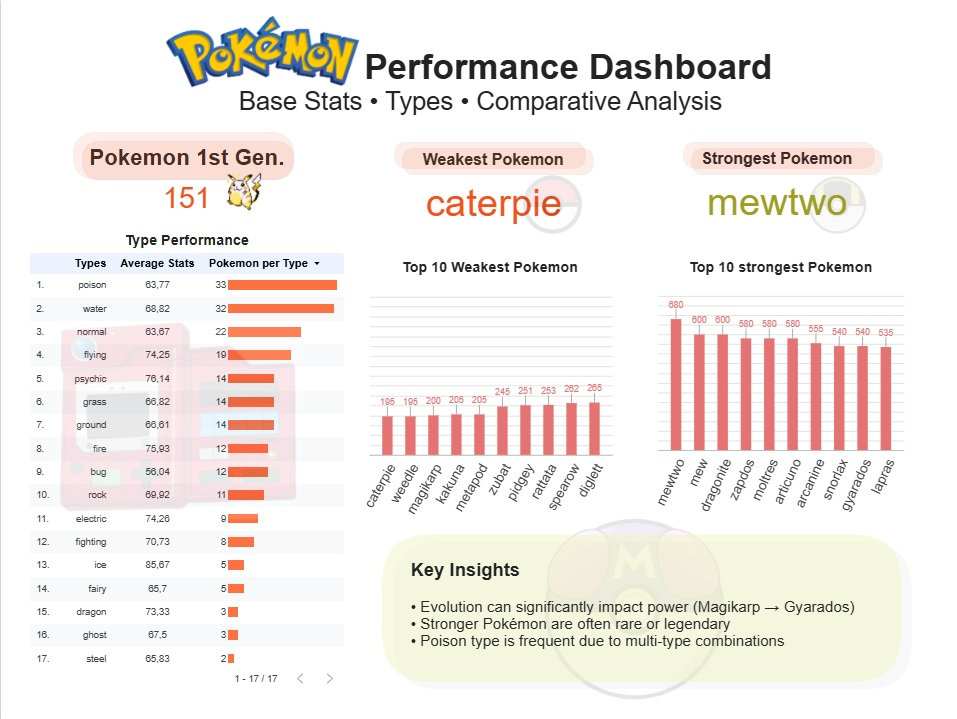

# Pokémon Analytics

🇧🇷 Versão em Português
🇺🇸 English version below

---

# 🇧🇷 Pokémon Analytics

Projeto de engenharia e análise de dados utilizando a PokeAPI, estruturado em um pipeline completo de dados: extração, transformação, carga, análise e visualização.

---

## 🎯 Objetivo

Construir um pipeline de dados ponta a ponta para:

* Extrair dados da API pública da PokeAPI
* Tratar e normalizar os dados com Python
* Modelar os dados em estrutura relacional
* Carregar os dados em banco SQLite
* Realizar análises com SQL
* Desenvolver um dashboard interativo para visualização

---

## 🚧 Status do Projeto

* ✅ Extração de dados
* ✅ Transformação e modelagem
* ✅ Carga em banco SQLite
* ✅ Consultas SQL
* ✅ Dashboard finalizado

---

## 🛠️ Stack

* Python
* Pandas
* Requests
* Jupyter Notebook
* SQLite
* SQL
* Google Sheets
* Looker Studio

---

## 📁 Estrutura do Repositório

```bash id="ptstruct"
pokemon-analytics/
├── data/
│   ├── raw/
│   └── processed/
├── dashboard/
├── docs/
├── notebooks/
├── sql/
│   └── queries/
├── src/
├── README.md
├── requirements.txt
└── .gitignore
```

---

## 🔄 Pipeline de Dados

### 1. Extração

Consumo da PokeAPI e armazenamento dos dados brutos em formato JSON (`data/raw/`).

### 2. Transformação

Tratamento e normalização dos dados em tabelas analíticas:

* `pokemon`
* `types`
* `pokemon_types`
* `abilities`
* `pokemon_abilities`
* `stats`
* `pokemon_stats`

### 3. Carga

Inserção dos dados processados em banco SQLite (`pokemon.db`).

### 4. Análise (SQL)

Consultas analíticas com foco em:

* agregações
* rankings
* joins entre entidades

### 5. Visualização

Criação de dashboard no Looker Studio para análise exploratória e comparativa.

---

## 📊 Dashboard

🔗 **Dashboard:**  
https://datastudio.google.com/s/mpDKdXAvk0I

O dashboard apresenta:

* Total de Pokémon da 1ª geração
* Pokémon mais forte e mais fraco (Total Base Stats)
* Top 10 Pokémon mais fortes e mais fracos
* Análise de desempenho por tipo
* Insights analíticos sobre distribuição de poder



---

## 📊 Principais Análises

* Ranking de Pokémon por soma de atributos (Total Base Stats)
* Média de atributos por tipo
* Distribuição de tipos
* Comparação entre Pokémon mais fortes e mais fracos

---

## 📊 Principais Insights

* A evolução pode gerar mudanças significativas de poder: Magikarp evolui para Gyarados, saindo do grupo mais fraco para o grupo mais forte.
* Pokémon com maior valor de atributos totais tendem a ser de tipos raros ou lendários.
* O tipo Poison apresenta alta frequência por estar frequentemente combinado com outros tipos (como Grass e Bug).

---

## ▶️ Como Executar

### Instalar dependências

```bash id="ptinstall"
pip install -r requirements.txt
```

### Extrair dados

```bash id="ptextract"
python src/extract.py
```

### Transformar dados

```bash id="pttransform"
python src/transform.py
```

### Carregar no banco

```bash id="ptload"
python src/load.py
```

### Rodar consultas

```bash id="ptquery"
python src/query.py
```

---

# 🇺🇸 Pokémon Analytics

Data engineering and analytics project using the PokeAPI, structured as a complete data pipeline: extraction, transformation, loading, analysis, and visualization.

---

## 🎯 Objective

Build an end-to-end data pipeline to:

* Extract data from the public PokeAPI
* Clean and normalize data using Python
* Model data in a relational structure
* Load data into a SQLite database
* Perform analytical queries using SQL
* Develop an interactive dashboard for data visualization

---

## 🚧 Project Status

* ✅ Data extraction
* ✅ Data transformation and modeling
* ✅ Data loading (SQLite)
* ✅ SQL analysis
* ✅ Dashboard completed

---

## 🛠️ Tech Stack

* Python
* Pandas
* Requests
* Jupyter Notebook
* SQLite
* SQL
* Google Sheets
* Looker Studio

---

## 📁 Repository Structure

```bash id="enstruct"
pokemon-analytics/
├── data/
│   ├── raw/
│   └── processed/
├── dashboard/
├── docs/
├── notebooks/
├── sql/
│   └── queries/
├── src/
├── README.md
├── requirements.txt
└── .gitignore
```

---

## 🔄 Data Pipeline

### 1. Extraction

Data is collected from the PokeAPI and stored as raw JSON files in `data/raw/`.

### 2. Transformation

Data is cleaned and normalized into analytical tables:

* `pokemon`
* `types`
* `pokemon_types`
* `abilities`
* `pokemon_abilities`
* `stats`
* `pokemon_stats`

### 3. Loading

Processed data is loaded into a SQLite database (`pokemon.db`).

### 4. Analysis (SQL)

Analytical queries focusing on:

* aggregations
* rankings
* joins between entities

### 5. Visualization

Dashboard built in Looker Studio for exploratory and comparative analysis.

---

## 📊 Dashboard

🔗 **Dashboard:**  
https://datastudio.google.com/s/mpDKdXAvk0I

The dashboard includes:

* Total Pokémon from 1st generation
* Strongest and weakest Pokémon (Total Base Stats)
* Top 10 strongest and weakest Pokémon
* Performance analysis by type
* Analytical insights on power distribution


---

## 📊 Key Analyses

* Ranking Pokémon by total stats (Total Base Stats)
* Average stats by type
* Type distribution
* Comparison between strongest and weakest Pokémon

---

## 📊 Key Insights

* Evolution can generate significant power differences: Magikarp evolves into Gyarados, moving from one of the weakest to one of the strongest Pokémon.
* Pokémon with higher total stats tend to be rare or legendary.
* The Poison type is highly frequent due to its combination with other types such as Grass and Bug.

---

## ▶️ How to Run

### Install dependencies

```bash id="eninstall"
pip install -r requirements.txt
```

### Extract data

```bash id="enextract"
python src/extract.py
```

### Transform data

```bash id="entransform"
python src/transform.py
```

### Load database

```bash id="enload"
python src/load.py
```

### Run queries

```bash id="enquery"
python src/query.py
```
